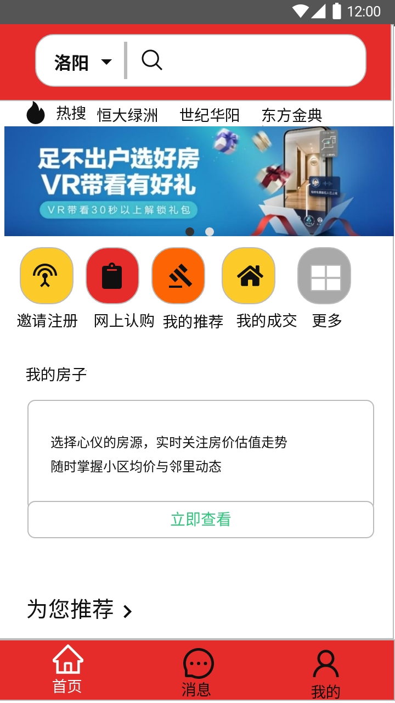
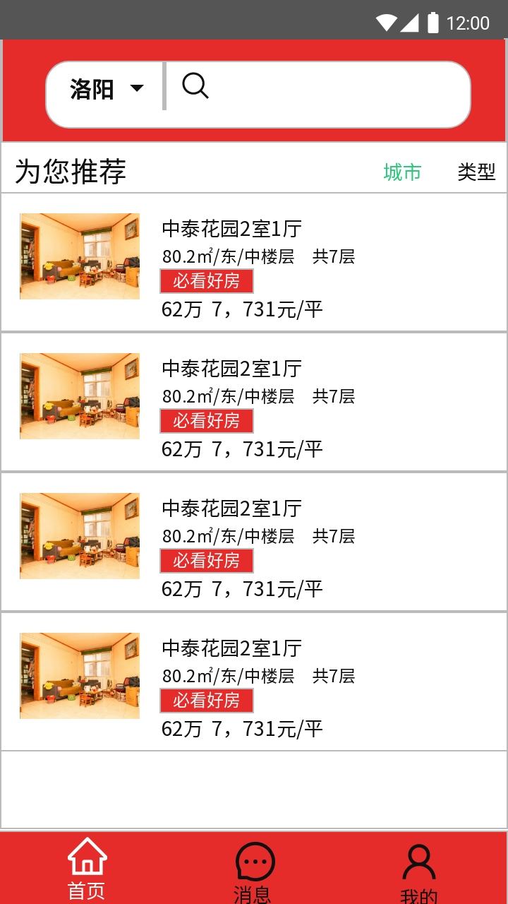
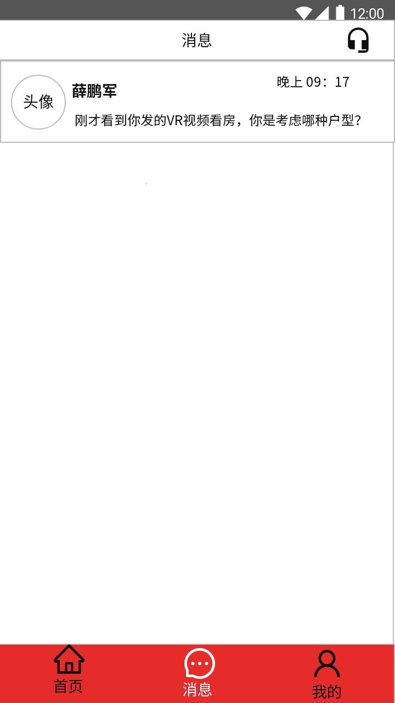
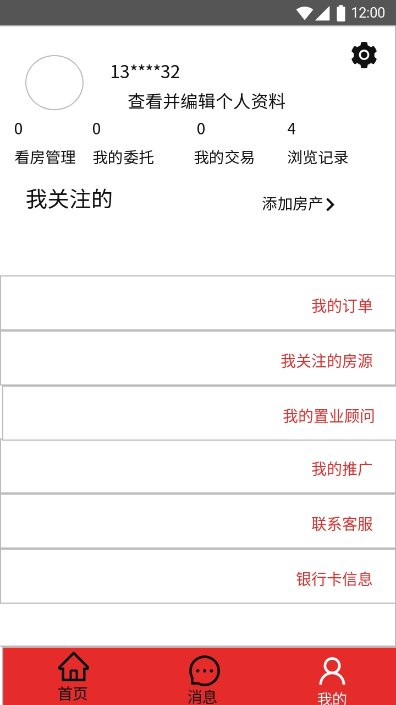

# 开始使用

> 使用 Vue.js 跨平台开发高质量原生（Android/iOS）应用。

## 文档

参考eeui官网，使用官方组件

## 原型图

## 安装

- 乐居 [Android版](https://www.pgyer.com/leju) 内测密码 1234

## 协议

* 遵循 [MIT 协议](http://opensource.org/licenses/MIT)
* 请自由地享受和参与开源
